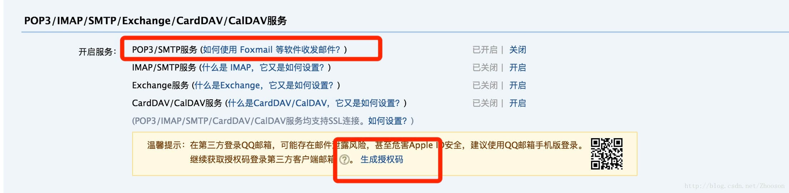

本项目基于**vue**的项目来讲解：

 - 准备一个QQ号，打开你的QQ邮箱，设置-> 账户


将SMTP服务设置 为 开启状态 ,并且点击生成授权码，将授权码保存好，后面会用到的

 - email.vue 的代码


```
<template>
  <div class="email">
    <form>
      <div class="input">
        <label for="name" class='label'>姓名</label>
        <input type="text" name="name" v-model.trim="formData.name" id="name" class="value">
      </div>
      <div class="input">
        <label for="name" class='label'>电话</label>
        <input type="text" name="phone" v-model.trim="formData.phone" id="phone" class="value">
      </div>
      <button class="send" type="submit" @click.stop.prevent="send(formData)">发送邮件</button>
    </form>
  </div>
</template>
<script>
import axios from 'axios';
export default {
  name: 'email',
  data() {
    return {
      formData: {
        name: '',
        phone: '',
      },
    };
  },
  methods: {
    send(data) {
      if (!data.name) {
        alert('请输入的你的姓名');
        return false;
      } else if (!data.phone) {
        alert('请输入的你的电话');
        return false;
      } else {
        axios({
          method: 'post',
          url: '/api/email',  // 后面会讲解
          data: data,
        });
      }
    },
  },
};
</script>
<style lang="scss" scoped>
.input {
  display: flex;
  .label {
    width: 0.3rem;
  }
  .value {
    flex: 1;
    border: 1px solid #dfdfdf;
  }
}
</style>

```

- build/dev-server.js(新版本vue-cli 已经没有dev-server.js，只有老版本才有)添加新的代码

```
// 加载body-parser 处理post提交过来的数据
var nodemailer = require("nodemailer");
var bodyParser = require('body-parser');
var app = express()
var apiRoutes = express.Router()

// bodyParser 设置,自动会在req上面添加
app.use(bodyParser.urlencoded({ extended: false }));
app.use(bodyParser.json());
apiRoutes.post('/email', function(req, res) {
    // console.info('req', req)
    // bodyParser 可以获取提交的数据，都保存在body上面
    var text = `这个人姓名叫${req.body.name }电话是${req.body.phone}，欢迎骚扰`
    if (req.body.name && req.body.phone) {
        res.json({
            iRet: 1,
            info: 'ok',
        });

        // Use Smtp Protocol to send Email
        var transporter = nodemailer.createTransport({
            //https://github.com/andris9/nodemailer-wellknown#supported-services 支持列表
            service: 'qq',  // 标注为QQ，不能为其他
            port: 465, // SMTP 端口
            secureConnection: true, // 使用 SSL
            auth: {
                user: "xxxx@qq.com",
                //这里密码不是qq密码，是你设置的smtp密码（授权码）
                pass: "*********"
            }
        });

        // setup e-mail data with unicode symbols
        var mailOptions = {
            to: "yyyyyyy@qq.com", // 接受者
            from: "xxxx@qq.com",  // 这里的from和上面的user 账号一样的
            subject: '我在学习发邮件', // 标题
            //text和html两者只支持一种
            text: text, // 标题
            // html: '<b>Hello world ?</b>' // html 内容
        };

        transporter.sendMail(mailOptions, function(error, info) {
            if (error) {
                return console.log(error);
            }
            console.log('Message sent: ' + info.response);
            transporter.close();
        });

    } else {
        res.json({
            iRet: -1,
            info: 'error',
        });
        return;
    }
});
app.use('/api', apiRoutes)
// 前端调取的url:'/api/email';如果这里app.use('/', apiRoutes),前端调取的url:'/email'

```

查看资料 ：
1. http://service.mail.qq.com/cgi-bin/help?subtype=1&&no=1001256&&id=28
2. https://www.jianshu.com/p/ee200a67853c
3. https://www.cnblogs.com/pingfan1990/p/4864822.html
