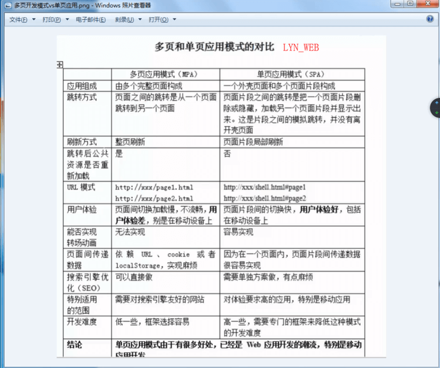

## javascript

### 1. 数据类型（如何准确判断出来类型）
>  备注： ES6 引入了一种新的原始数据类型Symbol，表示独一无二的值。

> 基本数据类型： string,number,boolean,null,undefined

> 引用类型： Function,Array,Object


访问 | 方式
---|---
基本类型  | 引用类型
操作和保存在变量的实际的值 | 值保存在内存中，js不允许直接访问内存，在操作的时候，操作的是对象的引用
保存在栈区 | 引用存放在栈区，实际对象保存在堆区


- typeof 主要用于判断数据是不是基本数据类型：String、Number、Object、Null、Undefined，但是无法判断出function（有些浏览器会出错）、array、regExp
-  instanceof主要的目的是用来检测引用类型，判断Array和RegExp，无法准确判断Function
-  Object.prototype.toString是对象的一个原生原型扩展函数，用来精确的区分数据类型


```
    typeof null // object

    1.	var type=Object.prototype.toString
    2.	console.log(type.call(''));//object String
    3.	console.log(type.call([]));//object Array
    4.	console.log(type.call({}));//object Object
    5.	console.log(type.call(false));//object Boolean
    6.	console.log(type.call(null));//object Null
    7.	console.log(type.call(undefined));//object Undefined
    8.	console.log(type.call(function(){}));//object Function
    9.	...
    console.log(type.call('')=="[object String]");//true
```

### 2.数组去重

```
var arr = [1,2,3,4,5,4,3,2,2,1,2,3,4,5,6,6,4,3]
```


```
    [...new Set(arr)] // es6的方法

    // 方法二
    function unique(arr) {
        var res = [],
            json = {};
        for (var i = 0; i < arr.length; i++) {
            if (!json[arr[i]]) {
                res.push(arr[i])
                json[arr[i]] = 1
            }
        }
        return res
    }

     // 方法三
     function unique(arr) {
        var res = [];
        for (var i = 0; i < arr.length; i++) {
            if (res.indexOf(arr[i]) == -1) {
                res.push(arr[i])
            }
        }
        return res
    }

    // 方法四 （缺点全部变成字符串）
    function unique(arr) {
        var json = {}
        arr.forEach(value => {
            json[value] = 1
        });
        return Object.keys(json)
    }

```

### 3.冒泡排序

```
var arr = [1, 4, 7, 8, 5, 3, 0, 6, 8, 5, 4, 3, 4, 6, 8]

function debunce(arr) {
    var len = arr.length;
    for (var i = 0; i < len; i++) {
        for (var j = 0; j < len - i - 1; j++) {
            if (arr[j] > arr[j + 1]) {
                var tmp = arr[j + 1];
                arr[j + 1] = arr[j]
                arr[j] = tmp
            }
        }
    }
    return arr
}
debunce(arr)

```
```
// sort 的排序方法
arr.sort((a,b)=>a-b)
```

### 4.节流函数 防抖

```
    delay = (function() {
        var timer = null;
        return function(callback, ms) {
            clearTimeout(timer);
            timer = setTimeout(callback, ms)
        }
    })()

    //方法
    delay(function() {
        //....
    }, 300);

    lodash.js 中的 _.debounce

```


### 5. 统计字符串出现次数最多

```
var str = 'dlkjsdgljkslasdjlkasjdaslhglsdjhgkfdjjasjasljfslfsdkgfhsdl';

function cac(str) {
    var json = {};
    for (var i = 0; i < str.length; i++) {
        if (!json[str.charAt(i)]) {
            json[str.charAt(i)] = 1
        } else {
            json[str.charAt(i)]++
        }
    }
    var max = 0,
        unit = '';
    for (var key in json) {
        if (json[key] > max) {
            max = json[key];
            unit = key
        }
    }
    console.info('最多max', max, '多少次unit', unit)
}

cac(str)
```

### 6. 递归的函数

```
    // 递归
    function num(n) {
        if (n == 1) return 1
        return num(n - 1) + n
    }
    num(100)


    function factorial(num) {
        if (num <= 1) {
            return 1;
        } else {
            return num * arguments.callee(num - 1);
        }
    }
```


### 7. 如何获取url上面的参数

```
    // 如何获取url上面的参数
    var url = "http://www.runoob.com/jquery/misc-trim.html?channelid=12333&name=xiaoming&age=23"
    var foo = url.split('?')[1].split('&'); //["channelid=12333", "name=xiaoming", "age=23"]
    var obj = {};

    for (var value of foo) {
        var key = value.split('=')[0]
        var val = value.split('=')[1]
        console.info(key, val)
        obj[key] = val
    }
```

### 8. js去除空格


```
var str = ' sf jj l '

// 全部 str.replace(/\s+/g, '')
// 2头 str.replace(/^\s*|\s*$/,'')
// 左边 str.replace(/^\s*/g, '')
// 左边 str.replace(/\s*$/g, '')
```


### 9. this的理解
参考文章 [追梦子this的介绍](https://www.cnblogs.com/pssp/p/5216085.html)

### 10. 什么是闭包（写一个例子）
> 可以访问其他函数内部的变量

```
 funtion test(){
     var name = 'hello world'
     return name
 }
 var text = test()  // hello world'
```

### 11. apply call bind
参考文章 [JavaScript中call,apply,bind方法的总结。](https://www.cnblogs.com/pssp/p/5215621.html)


### 12. jsonp的原理
> 只要协议、域名、端口有任何一个的不同，就被当作是跨域。
- JSONP
- CORS
- Server Proxy
- location.hash
- window.name
- postMessage
- document.domain


### 13. 堆栈的理解（深拷贝浅拷贝）
> 基本类型：undefined,null,Boolean,String,Number,Symbol
> 引用类型：Object,Array,Date,Function,RegExp等

 <font  color=red >基本数据类型存放在栈中 基本数据类型值不可变。</font>

> 存放在栈内存中的简单数据段，数据大小确定，内存空间大小可以分配，是直接按值存放的，所以可以直接访问

> 基本数据类型的值是不可变的，动态修改了基本数据类型的值，它的原始值也是不会改变的，

<font  color=red >引用类型存放在堆中 引用类型值可变</font>
> 引用类型（object）是存放在堆内存中的，变量实际上是一个存放在栈内存的指针，这个指针指向堆内存中的地址。每个空间大小不一样，要根据情况开进行特定的分配，

<font  color=#00ced1 >深拷贝 & 浅拷贝</font>
- 浅拷贝：仅仅是复制了引用，彼此之间的操作会互相影响
- 深拷贝：在堆中重新分配内存，不同的地址，相同的值，互不影响

### 14. 例举至少 3 种强制类型转换和 2 种隐式类型转换?

- 三种强制类型转换：String()，Boolean()，Number()；(parseInt和parseFloat)
- 2种隐式类型：+和-

### 15. 请简述 AJAX 及基本步骤, 优缺点
-  优点


> 1. 最大的一点是页面无刷新，在页面内与服务器通信，给用户的体验非常好。

> 2. 使用异步方式与服务器通信，不需要打断用户的操作，具有更加迅速的响应能力。

> 3. 可以把以前一些服务器负担的工作转嫁到客户端，利用客户端闲置的能力来处理，减轻服务器和带宽的负担，节约空间和宽带租用成本。并且减轻服务器的负担，ajax的原则是“按需取数据”，可以最大程度的减少冗余请求，和响应对服务器造成的负担。

- 缺点
> ajax干掉了back按钮，即对浏览器后退机制的破坏。
> 安全问题
> 对搜索引擎的支持比较弱。


```
window.onload = function() {
    //1.获取a节点，并为其添加onclick响应函数
    document.getElementsByTagName("a")[0].onclick = function() {
        //2创建一个XMLHttpRequest对象
        var request = new XMLHttpRequest();
        //3准备发送请求的url
        var url = this.href;
        var method = "GET";
        //4.调用XMLHttpRequest对象的open方法
        request.open(method, url);
        //6.调用XMLHttpRequest对象的send方法
        request.send(null);
        request.onreadystatechange = function() {
            //7.判断响应是否完成：XMLHttpRequest对象的readyState属性为4的时候
            if (request.readyState == 4) {
                //8.再判断响应式是否可用：XMLHttpRequest对象status属性值为200
                if (request.status == 200 || request.status == 304) {
                    // 9. 打印结果
                    alert(request.responseText);
                }
            }
        }
        return false;
    }
}
```

### 16.同步和异步的区别?

> 同步是阻塞模式，异步是非阻塞模式。

- 同步就是指一个进程在执行某个请求的时候，若该请求需要一段时间才能返回信息，那么这个进程将会一直等待下去，知道收到返回信息才继续执行下去；

- 异步是指进程不需要一直等下去，而是继续执行下面的操作，不管其他进程的状态。当有消息返回式系统会通知进程进行处理，这样可以提高执行的效率。

### 17. sessionStorage和localstroage与cookie之间有什么关联
> sessionStorage对象
- sessionStorage 对象是存储特定于某个会话的数据，当页面被重新加载时其仍然存在，只有当浏览器被关闭或者当前页面被关闭时，数据才会被清除；可以理解为数据被存储在浏览器中，只有浏览器被关闭后，数据才会被清除，同时，如果浏览器支持，在浏览器崩溃并重启之后仍然可以访问存储与sessionStorage中的数据

https://www.cnblogs.com/cherryshuang/p/8545681.html

### 18.setTimeout 和 promiae的执行顺序
- promise.Trick()>promise的回调>setTimeout>setImmediate
- Promise的任务会在当前事件循环末尾中执行，而setTimeout中的任务是在下一次事件循环执行
- 从规范上来讲，setTimeout有一个4ms的最短时间，也就是说不管你设定多少，反正最少都要间隔4ms才运行里面的回调（当然，浏览器有没有遵守这个规范是另外一回事儿）。而Promise的异步没有这个问题

```
setTimeout(() => {
    console.log(1)
}, 0);

new Promise((resolve) => {
    console.log(2)
    for (var i = 0; i < 10000; i++) {
        i == 9999 && resolve()
    }
    console.log(3)
}).then(() => {
    console.log(4)
});

console.log(5); // 2 3 5 4 1
```
### 19. 如何实现滚动加载的数据

```
      // 注册scroll事件并监听
      window.addEventListener('scroll', () => {
        console.info('可视区域大小' + document.documentElement.clientHeight + '........' + window.innerHeight)
        //console.info('滚动高度' + document.body.scrollTop) //原生的方法存在的兼容性问题 mac上面就计算出来是0
        var scrollTop = document.documentElement.scrollTop || window.pageYOffset || document.body.scrollTop;

        console.info('文档高度' + document.body.offsetHeight)

        //判断是否滚动到底部
        if (scrollTop + window.innerHeight + 0>= document.body.offsetHeight) { //0 表示距离底部多少的距离的开始触发loadmore效果
          if (!this.showlaoding) { //防止多次加载
            this.getData(this.page += 1)
          }
        }
      });


      $(window).scroll(function () {
        var scrollTop = $(this).scrollTop();
        var scrollHeight = $(document).height();
        var windowHeight = $(this).height();
        if (scrollTop + windowHeight == scrollHeight) {
           //异步加载数据的方法
        }
    });
```

### 20. seo和首屏加载方案
- JavaScript外联文件引用放在html文档底部；CSS外联文件引用在html文档头部，位于header内；

- http静态资源尽量用多个子域名；

- 服务器端提供html文档和http静态资源时，尽量开启gzip压缩；

- 在js，css，image等资源响应的http headers里，设置expires，last-modified；

- 尽量减少HTTP Requests的数量；

- js/css的minify：可统一通过combo handler做到压缩加合并；

- 减少不必要的301/302跳转：别让页面打开时间浪费在302多次跳转上（每次可能几十毫秒）；

- 请大量使用CSS Spirtes：这样做可以大大地减少CSS背景图片的HTTP请求次数；

- 首屏不需要展示的较大尺寸图片，请使用lazyload；

- 图片无损压缩的优化；

- 避免404错误：尽量减少外联js；

- 减少cookies的大小：尽量减少cookies的体积对减少用户获得响应的时间十分重要；

- 使用无cookies的域；

- 减少DOM Elements的数量；

- 引入textarea/script元素做延迟解析异步渲染


### 21. 数组的操作方案
- Array.join()方法，返回一个字符串
- Array.reverse()方法，返回逆序数组
- Array.sort()方法，返回排序后的数组。
- Array.concat(),创建并返回一个新数组。
- Array.slice()方法，返回指定数组的片段或者子数组。
- Array.splice()方法，用来删除或插入元素，会修改原数组！
- push()方法在数组的尾部添加一个或者多个元素，并返回数组的新长度。注意的是，改变的是原数组的值，返回的是新数组的长度。
- pop()方法删除数组的最后一个元素，并返回它的删除值。也是改变原数组，返回的是删除的值。
- unshift()方法类似于push()不同的是，他是在数组头部添加，其他都一样
- shift()方法则类比pop()方法。
- toString()方法将每个元素转化为字符串，类似于不传参的join()方法。
- forEach()方法，从头至尾遍历数组，为每个元素调用指定的函数。
- .filter()方法，返回的是调用数组的一个子集。
- every()方法是只有数组中所以元素都满足某个条件才会返回true；
- some()方法是只要有满足条件的值，就返回true。
- indexOf()和lastIndexOf()

### 22. 各种位置和高度计算:.position()、.offset()、.outerHeight()、.scrollTop、.scrollHeight、.clientHeight

[资料链接](https://blog.csdn.net/u012054869/article/details/52200052)


### 23. 数组推平

```
var arr = [1,[2,3,[4,5,6]],[7,8],[9,9]]

// 方法一
arr.toString().split(',')

// 方法二(缺点：只适合二位数组)
[].concat(...arr)

// 方法三
function flatten(arr){
    const flattened = [].concat(...arr)
    return flattened.some(item=>Array.isArray(item))?flatten(flattened):flattened
}


```

### 24. 数组的最大值和最小值
```
var arr=[1,2,3,4,5,6,10,7,9,11,20,19];

alert(Math.min.apply(null,arr));//获取数组中最小值

alert(Math.max.apply(null,arr));//获取数组中的最大值

```

### 25. 原生js提交表单

```
<form class="form-signin" id="myform" method="POST" action="/admin/login">

//拿到form
    var form = document.getElementById("myform")

    function submitFormData(){
        var myFD = new FormData(form)

        // 这里可以对form进行操作，使用ajax XMLHttpRequest,axios等发送
        console.dir(myFD)
        console.dir(form)

        alert("submitted")
    }

      form.addEventListener("submit", function (event) {
        event.preventDefault();   // 取消按键的原始提交行为
        submitFormData();         //启动监听提交按钮
    });
```

### 26. 单页面和多页面的区别



## vue 资料

### 1. 双向绑定的原理
- 答：vue.js 是采用数据劫持结合发布者-订阅者模式的方式，通过Object.defineProperty()来劫持各个属性的setter，getter，在数据变动时发布消息给订阅者，触发相应的监听回调。
具体步骤：
- 第一步：需要observe的数据对象进行递归遍历，包括子属性对象的属性，都加上 setter和getter
这样的话，给这个对象的某个值赋值，就会触发setter，那么就能监听到了数据变化
- 第二步：compile解析模板指令，将模板中的变量替换成数据，然后初始化渲染页面视图，并将每个指令对应的节点绑定更新函数，添加监听数据的订阅者，一旦数据有变动，收到通知，更新视图
- 第三步：Watcher订阅者是Observer和Compile之间通信的桥梁，主要做的事情是:
1、在自身实例化时往属性订阅器(dep)里面添加自己
2、自身必须有一个update()方法
3、待属性变动dep.notice()通知时，能调用自身的update()方法，并触发Compile中绑定的回调，则功成身退。
- 第四步：MVVM作为数据绑定的入口，整合Observer、Compile和Watcher三者，通过Observer来监听自己的model数据变化，通过Compile来解析编译模板指令，最终利用Watcher搭起Observer和Compile之间的通信桥梁，达到数据变化 -> 视图更新；视图交互变化(input) -> 数据model变更的双向绑定效果。


### 2. 生命周期
- 答：总共分为8个阶段创建前/后，载入前/后，更新前/后，销毁前/后。
- 创建前/后： 在beforeCreated阶段，vue实例的挂载元素$el和数据对象data都为undefined，还未初始化。在created阶段，vue实例的数据对象data有了，$el还没有。
- 载入前/后：在beforeMount阶段，vue实例的$el和data都初始化了，但还是挂载之前为虚拟的dom节点，data.message还未替换。在mounted阶段，vue实例挂载完成，data.message成功渲染。
- 更新前/后：当data变化时，会触发beforeUpdate和updated方法。
- 销毁前/后：在执行destroy方法后，对data的改变不会再触发周期函数，说明此时vue实例已经解除了事件监听以及和dom的绑定，但是dom结构依然存在


### 3. 钩子函数
- 全局守卫

```
router.beforeEach((to, from, next) => {
  // ...
})

```
- 全局后置钩子

```
router.afterEach((to, from) => {
  // ...
})
```

- 组件内守卫

```
const Foo = {
  template: `...`,
  beforeRouteEnter (to, from, next) {
    // 在渲染该组件的对应路由被 confirm 前调用
    // 不！能！获取组件实例 `this`
    // 因为当守卫执行前，组件实例还没被创建
  },
  beforeRouteUpdate (to, from, next) {
    // 在当前路由改变，但是该组件被复用时调用
    // 举例来说，对于一个带有动态参数的路径 /foo/:id，在 /foo/1 和 /foo/2 之间跳转的时候，
    // 由于会渲染同样的 Foo 组件，因此组件实例会被复用。而这个钩子就会在这个情况下被调用。
    // 可以访问组件实例 `this`
  },
  beforeRouteLeave (to, from, next) {
    // 导航离开该组件的对应路由时调用
    // 可以访问组件实例 `this`
  }
}
```

### 4. 父子组件的加载顺序

```
                |-- child.vue   （子组件，1）
|-- render.vue --
    （父组件）    |-- sencond.vue （子组件，2）

父组件-----created
父组件-----beforeMount
第一个子组件-----beforeCreate
第一个子组件-----created
第一个子组件-----beforeMount
第22222个子组件-----beforeCreate
第22222个子组件-----created
第22222个子组件-----beforeMount
第一个子组件-----mounted
第22222个子组件-----mounted
父组件-----mounted
```

### 5. vuex
[文档](https://vuex.vuejs.org/zh/)


## es6 资料
### 1. 使用过哪些方法
- 尖头函数
- 解构赋值 var {a, b} = data
- 对象运算扩展符  ...a
- Array.From()
- find
- filter
- some
- map
- Object.assign()  Object.keys Object.values
- set   new Set
- Promise
- for in遍历的是数组的索引（即键名），而for of遍历的是数组元素值。

### 2. let const var 的区别
```
let 允许你声明一个作用域被限制在块级中的变量、语句或者表达式
let绑定不受变量提升的约束，这意味着let声明不会被提升到当前
该变量处于从块开始到初始化处理的“暂存死区”。
var 声明变量的作用域限制在其声明位置的上下文中，而非声明变量总是全局的
由于变量声明（以及其他声明）总是在任意代码执行之前处理的，所以在代码中的任意位置声明变量总是等效于在代码开头声明
const 声明创建一个值的只读引用 (即指针)
这里就要介绍下 JS 常用类型
String、Number、Boolean、Array、Object、Null、Undefined
其中基本类型 有 Undefined、Null、Boolean、Number、String，保存在栈中；
复合类型 有 Array、Object ，保存在堆中；
基本数据当值发生改变时，那么其对应的指针也将发生改变，故造成 const申明基本数据类型时，
再将其值改变时，将会造成报错， 例如 const a = 3 ; a = 5 时 将会报错；
但是如果是复合类型时，如果只改变复合类型的其中某个Value项时， 将还是正常使用；
```

## sass
#### 1. 简述scss的特点
- 变量

```
    /*声明变量*/
    $color: #333;
    $bgcolor:#f36;

    body {
        color: $color;
        background-color: #f36;
    }

```

- 嵌套

```
    section {
        margin: 10px;
        nav {
        height: 25px;
            a {
                color: #0982c1;
                &:hover{
                    text-decoration: underline;
                }
            }
        }
    }

```

- Mixins

```
    @mixin error($borderWidth:2px){
        border: $borderWidth solid #f00;
        color: #f00;
    }

    .generic-error {
         @include error();/*直接调用error Mixins*/
    }


```


- 继承

```
    .block {
        margin: 10px 5px;
        padding:2px;

    }
    p {
        @extend .block;/*继承.block选择器下所有样式*/
        border: 1px solid #eee;
    }
```


## css
### 1. 清除浮动

[资料链接](https://blog.csdn.net/promisecao/article/details/52771856)


### 2. 垂直居中

[资料链接](https://www.cnblogs.com/hutuzhu/p/4450850.html)

### 3. 三角形

```
.jiao{
  position: relative;
  height: 0px;
  width: 0px;
  border-top: 90px solid transparent;
  border-right: 100px solid black;
  border-bottom: 100px solid transparent;
}
```

### 4. 1px的的问题
 ```
1 局部处理
    mate标签中的 viewport属性 ，initial-scale 设置为 1
    rem 按照设计稿标准走，外加利用transfrome 的scale(0.5) 缩小一倍即可；
2 全局处理
    mate标签中的 viewport属性 ，initial-scale 设置为 0.5
    rem 按照设计稿标准走即可
```


### 5. meta的问题

```
<!-- 设置缩放 -->
<meta name="viewport" content="width=device-width, initial-scale=1, user-scalable=no, minimal-ui" />
<!-- 可隐藏地址栏，仅针对IOS的Safari（注：IOS7.0版本以后，safari上已看不到效果） -->
<meta name="apple-mobile-web-app-capable" content="yes" />
<!-- 仅针对IOS的Safari顶端状态条的样式（可选default/black/black-translucent ） -->
<meta name="apple-mobile-web-app-status-bar-style" content="black" />
<!-- IOS中禁用将数字识别为电话号码/忽略Android平台中对邮箱地址的识别 -->
<meta name="format-detection"content="telephone=no, email=no" />
其他meta标签
<!-- 启用360浏览器的极速模式(webkit) -->
<meta name="renderer" content="webkit">
<!-- 避免IE使用兼容模式 -->
<meta http-equiv="X-UA-Compatible" content="IE=edge">
<!-- 针对手持设备优化，主要是针对一些老的不识别viewport的浏览器，比如黑莓 -->
<meta name="HandheldFriendly" content="true">
<!-- 微软的老式浏览器 -->
<meta name="MobileOptimized" content="320">
<!-- uc强制竖屏 -->
<meta name="screen-orientation" content="portrait">
<!-- QQ强制竖屏 -->
<meta name="x5-orientation" content="portrait">
<!-- UC强制全屏 -->
<meta name="full-screen" content="yes">
<!-- QQ强制全屏 -->
<meta name="x5-fullscreen" content="true">
<!-- UC应用模式 -->
<meta name="browsermode" content="application">
<!-- QQ应用模式 -->
<meta name="x5-page-mode" content="app">
<!-- windows phone 点击无高光 -->
<meta name="msapplication-tap-highlight" content="no">
```


### 6. 省略号 多行省略号
```
- 单行文本
overflow: hidden;
text-overflow:ellipsis;
white-space: nowrap;
当然还需要加宽度width属来兼容部分浏览。
```

```
- 多行文本
display: -webkit-box;
-webkit-box-orient: vertical;
-webkit-line-clamp: 3;
overflow: hidden;
```
 适用范围：

因使用了WebKit的CSS扩展属性，该方法适用于WebKit浏览器及移动端；

> 注：

- -webkit-line-clamp用来限制在一个块元素显示的文本的行数。 为了实现该效果，它需要组合其他的WebKit属性。常见结合属性：
- display: -webkit-box; 必须结合的属性 ，将对象作为弹性伸缩盒子模型显示 。
- -webkit-box-orient 必须结合的属性 ，设置或检索伸缩盒对象的子元素的排列方式 。
```
div {
    position: relative;
    line-height: 20px;
    max-height: 40px;
    overflow: hidden;
}
div:after {
    content: "..."; position: absolute; bottom: 0; right: 0; padding-left: 40px;
    background: -webkit-linear-gradient(left, transparent, #fff 55%);
    background: -o-linear-gradient(right, transparent, #fff 55%);
    background: -moz-linear-gradient(right, transparent, #fff 55%);
    background: linear-gradient(to right, transparent, #fff 55%);
}
不要只顾着吃，要注意胃口，此方法有个弊端 那就是 【未超出行的情况下也会出现省略号】 ，这样会不会很挫！！！ 没办法，只能结合JS 进行优化该方法了。
```
> 注

```
1、将height设置为line-height的整数倍，防止超出的文字露出。
2、给p::after添加渐变背景可避免文字只显示一半。
3、由于ie6-7不显示content内容，所以要添加标签兼容ie6-7（如：<span>…<span/>）；兼容ie8需要将::after替换成:after。
```

### 7.消除transition闪屏

```
.css {
    -webkit-transform-style: preserve-3d;
    -webkit-backface-visibility: hidden;
    -webkit-perspective: 1000;
}
过渡动画（在没有启动硬件加速的情况下）会出现抖动的现象， 以上的 解决方案只是改变 视角 来启动硬件加速的一种方式；
启动硬件加速的 另外一种方式：
.css {
    -webkit-transform: translate3d(0,0,0);
    -moz-transform: translate3d(0,0,0);
    -ms-transform: translate3d(0,0,0);
    transform: translate3d(0,0,0);
}
启动硬件加速
最常用的方式：translate3d、translateZ、transform
opacity属性/过渡动画（需要动画执行的过程中才会创建合成层，动画没有开始或结束后元素还会回到之前的状态）
will-chang属性（这个比较偏僻），一般配合opacity与translate使用（而且经测试，除了上述可以引发硬件加速的属性外，
其它属性并不会变成复合层），
弊端： 硬件加速会导致 CPU性能占用量过大，电池电量消耗加大 ；因此 尽量避免泛滥使用硬件加速。
```

### 8. 改变placeholder的字体颜色大小
```
input::-webkit-input-placeholder {
    /* WebKit browsers */
    font-size:14px;
    color: #333;
}
input::-moz-placeholder {
    /* Mozilla Firefox 19+ */
    font-size:14px;
    color: #333;
}
input:-ms-input-placeholder {
    /* Internet Explorer 10+ */
    font-size:14px;
    color: #333;
}

```


##  插件
### 1. 使用字体图标, 当字体没有加载出来的时候, 显示的是 X;
 - https://segmentfault.com/q/1010000000396844
 - https://www.aliyun.com/jiaocheng/671766.html
