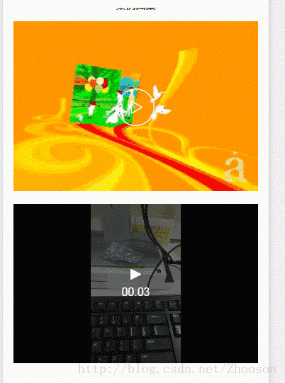

效果图：



本例子：是图片和多个视频混在一起


- html

```
<view class="case-ul">
      <repeat for="{{list}}" index="index" item="item" key="key">
        <view class="case-li case-view-item">
          <image hidden="{{item.isPlaying}}" style="" class="case-picture" src="{{item.path_url}}" mode="scaleToFill"></image>
          <!-- 是视频 -->
          <video wx:if="{{item.isPlaying}}" id="video-{{index}}" class="video" src="{{item.video_url}}" controls></video>
          <image wx:if="{{item.type==1}}" hidden="{{item.isPlaying}}" class="bt" mode="scaleToFill" @tap="playVideo({{item}},{{index}})" src="./images/play-bt.png"></image>  <!--前提一个播放的按钮-->
        </view>
      </repeat>
    </view>
```
1. list是一个数组
2. type 后台给我一个标识，0：图片 。 1：视频
3. isPlaying 前台自己添加是否播放视频
4. path_url 图片的地址。视屏也会反一个封面截图，字段都是path_url


- js
```
playVideo(item, index) {
  this.list.forEach(n => {
    n.isPlaying = false;
  })
  this.list[index].isPlaying = true;
  let videoContext = wx.createVideoContext(`video-${index}`)
  videoContext.play()
},
```
