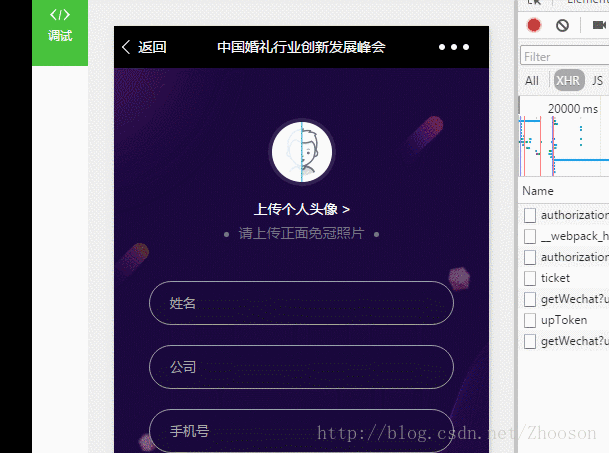

 - 上传头像功能，可以使用原生的ajax，现在有了axios封装好的ajax，通过formData的方式。
 - 上传七牛的图片，前提是要先从后台获取的一个token的，上传图片时候作为参数传给七牛。
 - 自己对应设置反向代理

[七牛的官方文档](https://developer.qiniu.com/kodo/manual/1272/form-upload)

效果如下：



以下只粘贴出关键代码：

```
<header class="header">
	<label class="avatar-bg">
		<!--默认显示的一张图片-->
		<div class="avatar" v-if="!previewAvatar"></div>
		<!--七牛回调的图片path-->
		
		<input ref="upload" id="upload" type="file" class="realfilebt" style="display: none;"/>
	</label>
	<!--mint-ui的progress的库-->
	<mt-progress v-if="!(progress==0||progress==100)" :value="progress" :bar-height="5"
	  class="progress"></mt-progress>
</header>
```

```
<script>
//引入axios
import axios from 'axios';
import Progress from 'mint-ui/lib/progress';
import 'mint-ui/lib/Progress/style.css';
//创建axios的实例
const axiosInstance = axios.create({});

export default {
	name: 'test',
	data() {
		return {
			files: [], // 文件
			uploadToken: '', // 上传文件 token
			previewAvatar: '', // 页面展示的avatar
			progress: 0, // 进度条
		};
	},
	//node版本要是8+，以上才能使用async await的方法
	async mounted() {
		let self = this;
		//页面加载 拉去token
		let tokenRes = await axios({
			url: '/api/sz/upToken',
		});
		this.uploadToken = tokenRes.data.token;
		this.$refs.upload.addEventListener('change', function() {
			//console.log(this.files)
			var data = new FormData();
			data.append('token', self.uploadToken);
			data.append('file', this.files[0]);
			axiosInstance({
				method: 'POST',
				url: 'http://up.qiniu.com',
				data: data,
				onUploadProgress: function(progressEvent) {
					var percentCompleted = Math.round(progressEvent.loaded * 100 / progressEvent.total);
					//console.log(percentCompleted)
					//对应上传进度条
					self.progress = percentCompleted;
				},
			})
				.then(function(res) {
					//console.log('res',res)
					let { base_url, path } = res.data;
					//页面所用字段
					self.previewAvatar = `${base_url}${path}?imageView2/1/w/154/h/154`;
					//传给后台不完整
					self.formData.avatar = `${path}`;

				})
				.catch(function(err) {
					console.log('err', err);
				});
		});
	},
	components: {
		[Progress.name]: Progress,   //mint-ui引入组件的方法
	},
};
</script>
```
