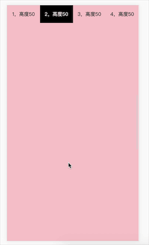

先学习这篇文章
[顶部吸顶的效果查看](http://blog.csdn.net/zhooson/article/details/78587539)

效果1：


效果2：


```
<template>
	<div>
		<header class="header" ref='header'>高度250</header>
		<ul class="nav" :class="{isFixed:isFixed}" ref="nav">
			<li class="item" v-for="(item,index) in new Array(4)" :key="index" @click="selectItem(index)"
			  :class="{'current':currentIndex===index}">{{index+1}}，高度50</li>
		</ul>
		<div class="fakeNavHeight" v-if="isFixed"></div>
		<ul class="content">
			<li class="tips" ref="foodList" v-for="(item,index) in new Array(4)" :key="index">{{index+1}}</li>
		</ul>
	</div>
</template>
```
```
<script>
var throttle = require('lodash/throttle'); //从lodash中引入的throttle节流函数
export default {
	name: 'stickUp',
	data() {
		return {
			listHeight: [],
			// currentIndex: 0,
			isFixed: false, //是否固定的
			throttleScroll: null, //定义一个截流函数的变量,
			scrollTop: 0, //页面实时滚动的距离
			headerHeight: '', //header部分的高度，
			navHeight: '', //nav部分的高度，
		};
	},
	computed: {
		currentIndex() {
			console.info('scrollTop', this.scrollTop, 'headerHeight', this.headerHeight, 'navHeight', this.navHeight);
			for (let i = 0; i < this.listHeight.length; i++) {
				let height1 = this.listHeight[i];
				let height2 = this.listHeight[i + 1];
				if (this.scrollTop - this.headerHeight >= height1 && this.scrollTop - this.headerHeight < height2) {
					return i;
				} else if ($(window).height() + this.scrollTop + 20 >= $(document).height()) {
					//到达底部还有20px 触发currentIndex选中 , 只针对最后一个元素不满整屏的高度的时候
					return this.listHeight.length - 2;
				}
			}
			return 0;
		},
	},
	methods: {
		selectItem(index) {
			console.info('index', index);
			//恒定时间
			var speed = 200; //滑动的速度
			$('body,html').animate({ scrollTop: this.listHeight[index] + this.headerHeight }, speed);
			return false;
		},
		//滚动的函数
		handleScroll() {
			this.headerHeight = $(this.$refs.header).outerHeight(); //header的高度
			this.scrollTop = $(window).scrollTop(); //滚动的距离的，为什么这里使用的jq，因为不用考虑的什么的兼容问题
			this.navHeight = $(this.$refs.nav).outerHeight(); //nav的高度
			//判断是否吸顶效果
			if (this.scrollTop > this.headerHeight) {
				this.isFixed = true;
			} else {
				this.isFixed = false;
			}
		},
		_calculateHeight() {
			let foodList = this.$refs.foodList;
			let height = 0;
			this.listHeight.push(height);
			for (let i = 0; i < foodList.length; i++) {
				let item = foodList[i];
				height += item.clientHeight;
				this.listHeight.push(height);
			}
			console.info('每个东西的高度', this.listHeight, '页面总的高度', $(window).height(), $(document).height());
		},
	},
	mounted() {
		this.$nextTick(() => {
			//这里使用监听的scroll的事件，为什么要使用的节流函数，如果不使用的，页面一直在滚动计算的，这样在
			//使用手机时候，出现非常卡的，隔一段时间计算，大大降低了性能的消耗（具体的好处自己去查资料）
			window.addEventListener('scroll', this.throttleScroll, false);
			this._calculateHeight();
		});
		this.throttleScroll = throttle(this.handleScroll, 100);
	},
	destroyed() {
		//离开页面需要remove这个监听器，不然还是卡到爆。
		window.removeEventListener('scroll', this.throttleScroll);
	},
};
</script>
```
```
<style lang="scss" scoped>
.header {
	height: 5rem;
	width: 100%;
	background-color: red;
}
.nav {
	display: flex;
	height: 1rem;
	background-color: transparent;
	line-height: 1rem;
	text-align: center;
	width: 100%;
	&.isFixed {
		position: fixed;
		left: 0;
		top: 0;
		z-index: 9999;
	}
	.item {
		flex: 1;
		&.current {
			background-color: #000;
			color: #fff;
			font-weight: 900;
		}
	}
}
.fakeNavHeight {
	height: 1rem;
	width: 100%;
}
.content {
	.tips {
		height: 15rem;
		width: 100%;
		&:first-child {
			background-color: red;
		}
		&:nth-child(2) {
			background-color: pink;
		}
		&:nth-child(3) {
			background-color: yellow;
		}
		&:last-child {
			background-color: blue;
			height: 6rem;
		}
	}
}
</style>


```
