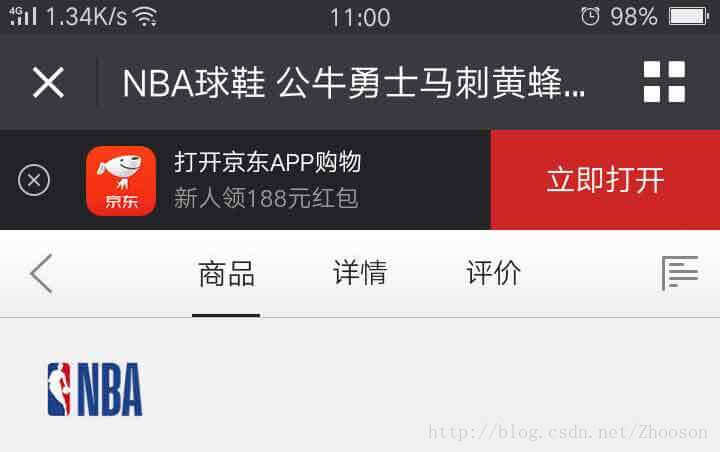
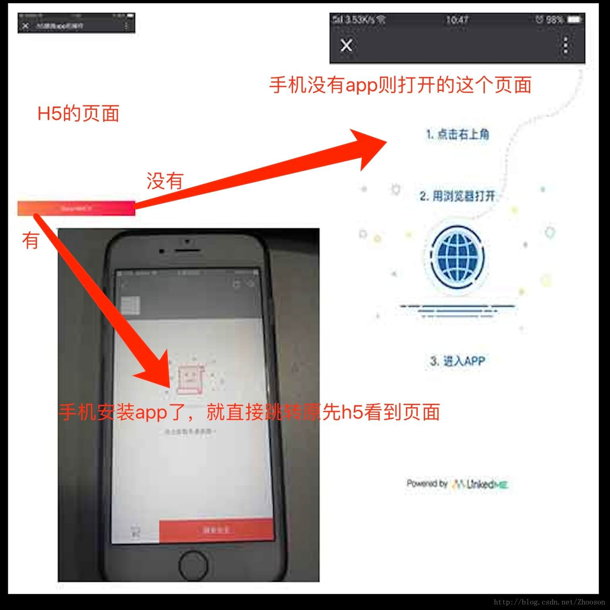

现在好多的app应用都有对应的h5页面，那么h5和app直接是如何交互的呢？
如图：


这一个按钮就是通向app的传送通道，那么这个功能是如何实现的呢？
本文以vue的示例来讲解

先看效果图：



现在首先创建一个vue页面，

```
<template>
  <div class="H5ToApp">
    <div class="btn">在app内部打开</div>
  </div>
</template>

<script>
export default {
  name: 'app',
  data() {
    return {};
  },
  methods: {},
  mounted() {}

};
</script>

<style lang="scss" scoped>
.H5ToApp {
  height: 100vh;
  width: 100%;
  .btn {
    background-image: -webkit-linear-gradient(
      180deg,
      rgb(251, 17, 72) 0%,
      rgb(253, 133, 80) 100%
    );
    width: 100%;
    height: 1rem;
    position: fixed;
    bottom: 0;
    left: 0;
    right: 0;
    color: #fff;
    font-size: 0.3rem;
    display: flex;
    align-items: center;
    justify-content: center;
  }
}
</style>
```

本项目的目录结构：


- linkedme.min.js 的下载地址（https://static.lkme.cc/linkedme.min.js）

- 开始编写linkedme,js的文件

```
let linkedmePromise =
    import ('src/assets/vendor/linkedme.min.js')
let linkedmeType = "live";


let defaultData = {};
defaultData.type = linkedmeType; //表示现在使用线上模式,如果填写"test", 表示测试模式.【可选】
defaultData.feature = "功能名称"; // 自定义深度链接功能，多个用逗号分隔，【可选】
defaultData.stage = "阶段名称"; // 自定义深度链接阶段，多个用逗号分隔，【可选】
defaultData.channel = "渠道名称"; // 自定义深度链接渠道，多个用逗号分隔，【可选】
defaultData.tags = "标签名称"; // 自定义深度链接标签，多个用逗号分隔，【可选】
defaultData.ios_custom_url = ""; // 自定义iOS平台下App的下载地址，如果是AppStore的下载地址可以不用填写，【可选】
defaultData.android_custom_url = "http://a.app.qq.com/o/simple.jsp?pkgname=com.xxxxx.weddingvideo"; // 自定义安卓平台下App的下载地址，【可选】
// 下面是自定义深度链接参数，用户点击深度链接打开app之后，params参数将被带入app
// 比如详情页面的参数，可以写进去，这样唤起app后可直接跳转到详情页【可选】

export default async function(para) {
    await linkedmePromise
    if (linkedme.LinkedME_KEY !== "b5942bd492c086472413db07481c6a7ff") {
        linkedme.init("b5942bd492c086472413db07481c6a7ff", { type: linkedmeType }, null);

    }
    para = para || {}
    let str = '';
    for (let k in para) {
        str += `"${k}":"${para[k]}",`
    }
    str = str.slice(0, -1)
    let params = `{${str}}`

    // console.log('params',params)

    return new Promise((resolve, reject) => {
        // console.log({
        //   ...defaultData,
        //   ...{params: params},
        // })
        linkedme.link({
            ...defaultData,
            ... { params: params },
        }, function(err, data) {
            if (err) {
                // 生成深度链接失败，返回错误对象err
                console.log(err)
                alert(err.message)
                reject(err)
            } else {
                // console.log(data.url)
                /*
                 生成深度链接成功，深度链接可以通过data.url得到，
                 将深度链接绑定到<a>标签，这样当用户点击这
                 个深度链接，如果是在pc上，那么跳转到深度链接二维
                 码页面，用户用手机扫描该二维码就会打开app；如果
                 在移动端，深度链接直接会根据手机设备类型打开ios
                 或者安卓app
                 */
                // console.log('data',data)
                resolve(data)
            }
        }, false);

    });

}
```

对应的组件中需要修改以下

```
<template>
  <div class="H5ToApp">
	  <!--需要使用a标签-->
    <a class="btn" :href="href">在app内部打开</a>
  </div>
</template>

<script>
//脚手架配置了alias
import linkedmeLink from 'src/assets/script/linkedme.js';
export default {
  name: 'app',
  data() {
    return {
      href: '',
    };
  },
  methods: {},
  mounted() {
    //detailid,view 这个名字找app要的
    linkedmeLink({
      // detailid: this.$route.params.id,
      detailid: 4, //当前id
      view: 'waredetail', //跳转app的名字
    }).then(res => {
      this.href = res.url;
    });
  },
};
</script>
```

**linkedme的文档**（https://pagedoc.lkme.cc/js-sdk-download.html）
