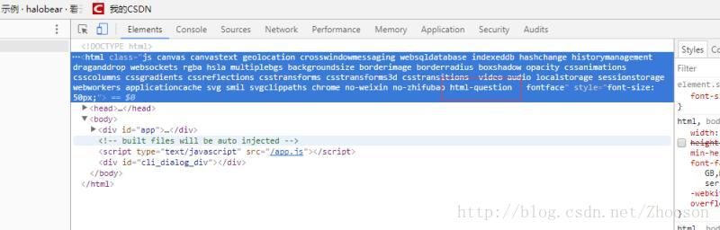

- main.js

```

const router = new Router({   //对官方的脚手架做出部分修改
  mode: 'hash', // ['history', 'hash']
  linkActiveClass: 'active', // active class 名称
  scrollBehavior(to, from, savedPosition) { // 后退页面时, 保留滚动位置
    if (savedPosition) {
      return savedPosition;
    }
    return { x: 0, y: 0 };
  },
  //路由
  routes: [
    {
      path: '/solution',
      component: Question,
    }, {
      path: '/solution/question',
      name: 'question',
      component: Question,
    }
    ]
});


//这才是重点。。。。
router.beforeEach((to, from, next) => {
  // html加class ==>给每个组件添加一个className ，min-height：100vh；有些手机是不兼容
  //使用方法：html-路由的名称 组成的一个className：height:100%;width:100%; 全屏充满
  //这个className的查看方法 控制台 Element 即可
    const fromName = from.name || '';
    const toName = to.name || '';
    if (fromName) {
      document.documentElement.classList.remove(`html-${fromName}`); //remove className
    }
    document.documentElement.classList.add(`html-${toName}`);  //add className
  next();
})

export default router;
```
- 查看的方法


 用法：
 question组件中：


```
<style lang='scss' scoped>
.html-question { //充满当前整个屏幕
	height:100%;
	width:100%;
	background-color:red;
}
</style>
```

充满当前整个屏幕 还有另外一种方法（如下）

```
<style lang='scss' scoped>
.question { //不是全局的cssName
	min-height:100vh; //不是所有的版本都兼容这个写法 。上面的方法万能的
	width:100%;
	background-color:red;
}
</style>
```
