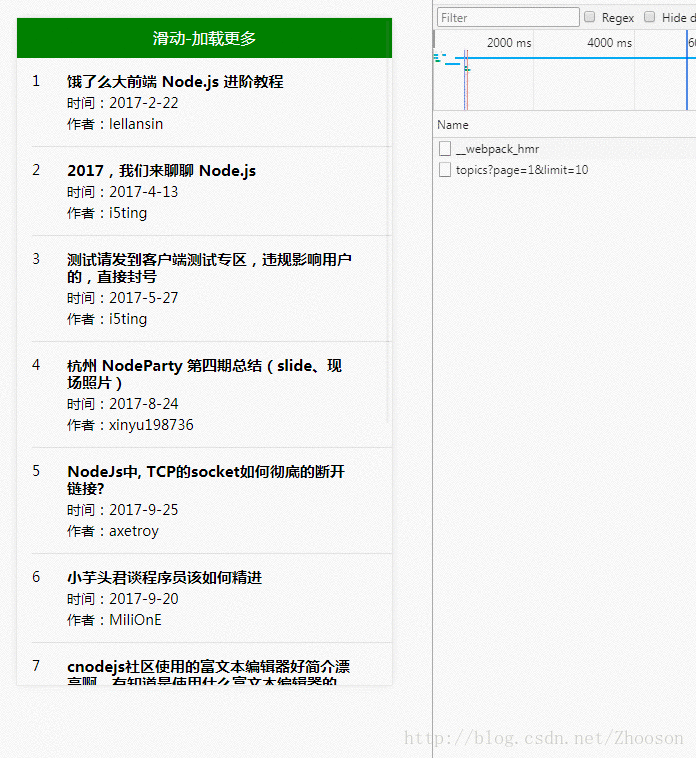

- 这个组件使用了http://fontawesome.dashgame.com/ 的loading的效果

//main.js 入口文件

```
import axios from 'axios'
// Vue.prototype.axios = axios 组件调用this.axios.get(...)
// Vue.prototype.$ajax = axios  换个名字 组件调用this.$ajax.get(...)
window.axios = axios;  //组件中调用 axios.get(...)

```
//loadmore.vue 组件（我配置的是sass语法，望悉知！！）

```
<template>
  <div class="loadmore">

    <header class="header">滑动-加载更多</header>

    <ul class="ul">
      <li class="list" v-for="(item,index) in list">
        <div class="list-left">{{index + 1}}</div>
        <div class="list-center">
          <div class="msg">{{item.title}}</div>
          <div class="time">时间：{{item.create_at}}</div>
          <div class="author">作者：{{item.author.loginname}}</div>
        </div>
      </li>
    </ul>

    <div class="loadmore-icon">加载更多<i class="fa fa-cog fa-spin"></i></div>
    <div class="loading" v-show="showlaoding">
      <i class="fa fa-spinner fa-spin fa-3x fa-fw margin-bottom"></i>
    </div>

  </div>
</template>
<script>

  export default {
    name: 'loadmore2',
    data() {
      return {
        list: [],//数据
        page: 1,//页码
        showlaoding: true //是否显示loading效果
      }
    },
    methods: {
      getData(page) {
        this.showlaoding = true
        axios.get('https://cnodejs.org/api/v1/topics', {
          params: {
            page: page,
            limit: 10
          }
        })
          .then((res) => {
            if (res.status == 200) {
              let list = res.data.data
              list.map(n => this.list.push(n))
              this.list.forEach(n => {
                const d = new Date(n.create_at)
                n.create_at = `${d.getFullYear()}-${d.getMonth() + 1}-${d.getDate()}`
              })
              this.showlaoding = false

            }
          })
          .catch((error) => {
            console.log(error);
          });
      },
    }
    ,
    mounted() {
      this.getData(this.page);


      // 注册scroll事件并监听
      window.addEventListener('scroll', () => {
        console.info('可视区域大小' + document.documentElement.clientHeight + '........' + window.innerHeight)
        //console.info('滚动高度' + document.body.scrollTop) //原生的方法存在的兼容性问题 mac上面就计算出来是0
		var scrollTop = document.documentElement.scrollTop || window.pageYOffset || document.body.scrollTop;

        console.info('文档高度' + document.body.offsetHeight)

        //判断是否滚动到底部
        if (scrollTop + window.innerHeight + 0>= document.body.offsetHeight) { //0 表示距离底部多少的距离的开始触发loadmore效果
          if (!this.showlaoding) { //防止多次加载
            this.getData(this.page += 1)
          }
        }
      })

    }
／／原生的方法存在浏览器兼容的问题的，最好的办法就是的是jq大法，不需要考虑的兼容新的问题的

  }
</script>
<style lang="scss" scoped>
  .loadmore {
    min-height: 100vh;
    width: 100%;
    padding-top: 0.8rem;
  }

  .header {
    position: fixed;
    top: 0;
    left: 0;
    right: 0;
    height: 0.8rem;
    display: flex;
    align-items: center;
    justify-content: center;
    background-color: green;
    color: #ffffff;
    font-size: 0.32rem;
  }

  .ul {
    width: 100%;
  }

  .list {
    padding: 0.3rem;
    display: flex;
    position: relative;
    &:last-child {
      &:after {
        display: none;
      }
    }
    &:after {
      content: '';
      display: block;
      left: 0.3rem;
      right: 0;
      bottom: 0;
      background-color: #dfdfdf;
      height: 1px;
      width: 100%;
      position: absolute;
    }
    .list-left {
      width: 0.5rem;
    }
    .list-center {
      flex: 1;
      padding-left: 0.2rem;
      margin-right: 0.5rem;
      .msg {
        font-size: 0.3rem;
        font-weight: 900;
      }
      .author {
        margin-top: 0.1rem;
      }
      .time {
        margin-top: 0.1rem;
      }
    }
  }

  .loadmore-icon {
    display: flex;
    align-items: center;
    justify-content: center;
    background-color: #f8f8f8;
    padding: 0.2rem 0;
  }

  .loading {
    position: fixed;
    left: 0;
    right: 0;
    top: 0;
    bottom: 0;
    background-color: rgba(#000, .3);
    display: flex;
    align-items: center;
    justify-content: center;
  }

</style>


```
